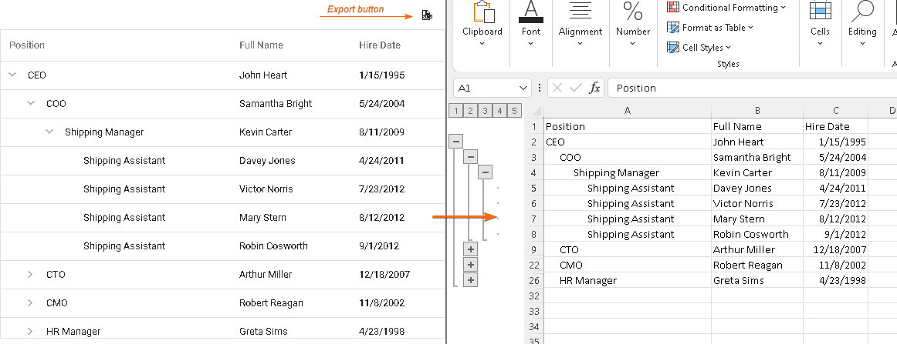

<!-- default badges list -->

[](https://supportcenter.devexpress.com/ticket/details/T1188167)
[](https://docs.devexpress.com/GeneralInformation/403183)

<!-- default badges end -->

# TreeList for DevExtreme - Export to Excel

While TreeList does not have a built-in export feature, you can use the ExcelJS and FileSaver libraries to accomplish a similar functionality.



## Implementation details

- Install or reference the ExcelJS and file-saver packages.
- Add a reference to the `excelExporter` file (see the `excelExporter` file for your framework below).
- Define the export button in the TreeList toolbar.
- Implement the export button's onClick handler and call the `exportTreeList` method.

```js
function exportToExcel() {
  const workbook = new ExcelJS.Workbook();
  const worksheet = workbook.addWorksheet('Employees');

  exportTreeList({
    component: treeList,
    worksheet,
  }).then(() => {
    workbook.xlsx.writeBuffer().then((buffer) => {
      saveAs(
        new Blob([buffer], { type: 'application/octet-stream' }),
        'Employees.xlsx',
      );
    });
  });
}
```

## Files to Review

- **jQuery**
  - [index.js](jQuery/src/index.js)
  - [excelExporter.js](jQuery/src/excelExporter.js)
- **Angular**

  - [app.component.html](Angular/src/app/app.component.html)
  - [app.component.ts](Angular/src/app/app.component.ts)
  - [excelExporter.ts](Angular/src/app/excelExporter.ts)

- **Vue**
  - [Home.vue](Vue/src/components/HomeContent.vue)
  - [excelExporter.ts](Vue/src/assets/excelExporter.ts)
- **React**

  - [App.tsx](React/src/App.tsx)
  - [excelExporter.ts](React/src/excelExporter.ts)

- **NetCore**
  - [Index.cshtml](ASP.NET%20Core/Views/Home/Index.cshtml)
  - [excelExporter.js](ASP.NET%20Core/wwwroot/js/excelExporter.js)

## Documentation

- [Getting Started with TreeList](https://js.devexpress.com/Documentation/Guide/UI_Components/TreeList/Getting_Started_with_TreeList/)
- [TreeList - toolbar API reference](https://js.devexpress.com/Documentation/ApiReference/UI_Components/dxTreeList/Configuration/toolbar/)
